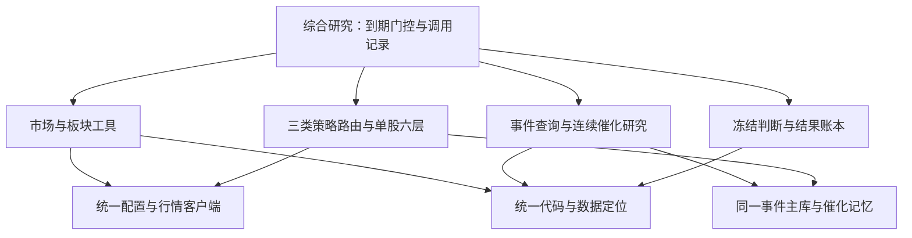

# 连接层约定

2026-10-08。解决独立模块在路径、配置和数据源选择上的分歧，不修改投资评分、
买卖规则或正式口令边界。正式流程仍以 `ACTIVE_ENTRYPOINTS.md` 为准。

## 共同连接规则

| 对象 | 唯一实现 | 约定 |
|---|---|---|
| 代码位置 | `skills/shared/paths.py:repo_root` | 始终是当前代码仓库，不随活动数据目录变化 |
| 活动数据 | `workspace_root` | 启动环境的绝对路径 `TZ_CODEX_HOME`；未设置则使用仓库父目录 |
| 项目配置 | `config_file` | 指定工作区时读取其 `repo/.env`；未指定时读取当前仓库 `.env` |
| 事件主库 | `event_db_path` | 所有事件消费者和写入入口共用；支持启动环境 `EVENT_MAP_DB`，相对路径基于工作区 |
| 行情密钥与客户端 | `skills/shared/datasource.py` | 项目Tushare密钥优先于旧进程密钥；其他配置保持进程优先；SDK客户端延迟创建 |
| 连续研究状态 | 现有事件库、催化记忆、决策账本 | 数据存储职责不合并；路径共用同一工作区 |

`TZ_CODEX_HOME` 和 `EVENT_MAP_DB` 必须在启动前确定，不从 `.env` 中途改变路径。
这是为了防止先导入的模块和后导入的模块读到不同的数据。未指定工作区时，
移动整个工作区即可使用，不再依赖某个用户名的桌面路径。

环境加载支持普通赋值、`export`、单/双引号和行尾注释。不执行Shell，不展开变量。
缺少密钥、配置格式错误会明确报错，错误信息不回显配置值。密钥更新后重新读取，
不缓存SDK客户端；切换工作区时撤回本模块之前注入的项目密钥，避免串用上一个项目的密钥。
六层获取客户端的原有 `~/.tushare_token` 兼容入口保留，仅在项目/进程均无密钥时使用。

## 模块如何构成整体

综合研究由AI按既有工作流调用，不是后台全自动交易系统。箱体、全景和三类策略
保持各自职责；“统一连接”不意味着每次研究都跑所有工具，也不意味着三类策略混排。

脚本只保留找到当前代码仓库及必要同目录模块的启动引导；配置和数据源选择委托共享层。
无需先把通用名称 `skills` 安装为全局包。研究回放和通知辅助工具也使用共享连接；
通知只验证启动，不发送消息或启用调度。`archive/`、冻结实验和旧框架快照生成器保持历史边界。

离线恢复包以当前代码仓库和所选活动工作区为来源。指定 `EVENT_MAP_DB` 时，实际选中的
主库仍按 `技能数据/event_map_shadow.db` 这个标准恢复名称入包，原路径记入manifest；
恢复后应清除旧路径覆盖或将它重新指向恢复出的主库。

## 变更验收

- 使用真实2026-10-05综合研究输入回放V2，与修改前逐字段比较；只排除运行生成的时间戳。
- 比较JUnit中的具体测试用例，不只比较通过数量；原186项必须全部保留通过。
- 独立进程复制代码至新目录，从仓库外以隔离模式启动24个入口，不依赖当前测试进程的导入路径。
- 验证事件查询、雷达、时间轴、催化档案和波段扫描对同一数据库覆盖的一致性。
- 验证旧进程密钥、引号配置、密钥更新、缺配置与跨工作区密钥隔离。
- 在线只读取一次交易日历验证真实认证；不运行全市场扫描，不写投资数据。

本次证据保存在工作区 `技能数据/运行记录/连接层修复/20261008/`。
Python 3.9运行环境存在urllib3/LibreSSL兼容警告，在线请求实测成功；运行环境升级另行处理。
